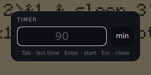

<p align="center">
  
</p>

# cclock

A small countdown timer for Wayland. It attaches to any screen edge, moves
between outputs, and stays out of the way until hovered.

| Running | Paused |
| --- | --- |
|  |  |



## Features

- Drag the timer between screen edges and outputs.
- Survive output disconnection, use a fallback, and return when it reconnects.
- Click to pause or resume; hover to reveal text and the close button.
- Configure running, paused, and overtime colors.
- Optionally protect one or every OLED output from static bright states.
- Control or query the timer from the command line.
- Run commands before start, at zero, and on stop.

## Install

```sh
nix profile install github:tenyoru/cclock
```

For a NixOS flake:

```nix
{
  inputs.cclock.url = "github:tenyoru/cclock";

  outputs = { nixpkgs, cclock, ... }: {
    nixosConfigurations.your-host = nixpkgs.lib.nixosSystem {
      modules = [{
        environment.systemPackages = [
          cclock.packages.x86_64-linux.default
        ];
      }];
    };
  };
}
```

## Usage

```sh
cclock -m 25 -t "Deep work"
cclock -m 5 --running-color steelblue --paused-color '#ffd60a'
cclock --screen DP-2 --oled DP-2 -m 25

cclock --pause
cclock --resume
cclock --toggle
cclock --focus
cclock --time-get
cclock --text-get
cclock --stop
```

For niri, a compositor shortcut can enter the timer's focus mode globally:

```kdl
Mod+Shift+C { spawn "cclock" "--focus"; }
```

In focus mode, use `h`/`l` on horizontal edges and `k`/`j` on vertical
edges. `Shift+H/J/K/L` moves the blob to the left/bottom/top/right edge, and
`Tab` toggles pause. `Ctrl+C` stops the timer, and `Escape` exits focus mode.
Set `keyboard.motion = true` to enable these keys by clicking the blob without
showing the focus outline. `--focus` works without that setting and shows the
outline until `Escape` or a drag.

Running cclock without a duration opens the time picker. Different duration
options are added, so `cclock -m 1 -s 30` starts at 90 seconds.

At zero, the blob changes to the overtime color and continues counting. The
overlay omits the leading `+`; `cclock --time-get` retains it for scripts.
While overtime is paused, the paused color takes precedence.

OLED protection applies only while the blob is on the output selected by
`oled.output` (`all` selects every output and `none` disables it). The whole blob
moves continuously and linearly by one collapsed blob width or height during
each `oled.interval`, cycling around its saved position while remaining fully
on-screen. On a protected output it uses 90% opacity until hovered.

Paused blobs and their digits remain visible. After `oled.timeout`, running
overtime switches from a red background to red digits on black. Hovering
restores full opacity and the full state color. Dropping the blob after a drag
exits focus mode and removes its focus outline.

The timer output is persisted in `cclock.conf`; `--screen` overrides it for one
run. It is not a `config.toml` key.

Run `cclock --help` for every command-line option, `man cclock` for the full
reference, and see [configuration](docs/configuration.md) for all TOML keys.

## Development

```sh
nix develop
just build
just test
nix flake check
MANPAGER=cat man -l ./cclock.1
git diff --check
```

cclock requires Linux, Wayland, and a compositor with layer-shell support. It
is developed and tested on niri.
